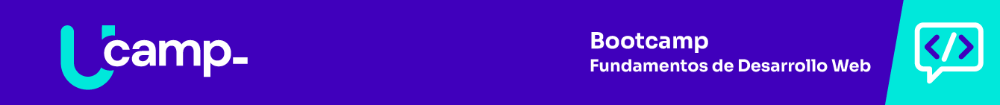

# M0S0: Fundamentos de Programación y Algoritmia

>#### Hola te doy la bienvenida, es un gusto tenerte aquí; en esta sesión, comenzaremos sobre los fundamentos sobre desarrollo de Software, lenguajes de programación y algoritmia básica.

# ÍNDICE

- [Conceptos Generales del Desarrollo de Software](https://github.com/U-Camp/BOOT-M0/blob/main/README.md#conceptos-generales-del-desarrollo-de-software)
    - [Lenguajes de Programación](https://github.com/U-Camp/BOOT-M0/blob/main/README.md#lenguajes-de-programaci%C3%B3n)
    - [Paradigmas de Programación](https://github.com/U-Camp/BOOT-M0/blob/main/README.md#paradigmas-de-programaci%C3%B3n)
    - [Full Stack Development](https://github.com/U-Camp/BOOT-M0/blob/main/README.md#full-stack-development)
- [Breve Historia de la World Wide Web](https://github.com/U-Camp/BOOT-M0/blob/main/README.md#breve-historia-de-la-world-wide-web)

# Conceptos Generales del Desarrollo de Software

## Lenguajes de Programación

Un lenguaje de programación ("programming language") es un lenguaje formal con reglas sintácticas, semánticas y gramaticales bien definidas (por ejemplo, un `if` debe tener siempre una condición por cumplir), el cual está conformado por un conjunto de palabras clave e instrucciones (`if, for, const, let, while`) que, al escribirse de manera correcta (código), se traducen en órdenes que algún dispositivo electrónico puede entender y ejecutar.

Los lenguajes de programación proveen y habilitan una estructura y un medio entendible (ambiente de desarrollo) para que se le puedan dictar instrucciones a un dispositivo. 

Estas instrucciones, al traducirse a lenguaje máquina o código ejecutable se transforman en software (conjunto de programas), el cual le describe a un hardware determinado, como puede realizar una o varias tareas (procesos) a partir de una entrada determinada (argumento) para producir una salida.

Los lenguajes de programación son viejos, tan viejos como el siglo IX, época en la que un grupo de eruditos árabes conocidos como los "Banu Musa " escribieron un estudio donde "describían un instrumento que sonaba por sí solo", y en el cual explicaban la forma en la que se podría construir un autómata que tocara la flauta siguiendo un algoritmo.

En la actualidad, los lenguajes de programación son parte inherente de todas las computadoras o dispositivos electrónicos, así como de todo lo que vemos a través de cualquier pantalla. 

Para llegar al punto en el que ya vemos el resultado de la ejecución del software, es necesario seguir una serie de pasos que nos permitirán llegar a la resolución de un problema determinado por medio del dispositivo, a esta serie de pasos se le llama algoritmo.

La palabra algoritmo, aunque es un término matemático, es muy usado en el mundo de la tecnología y nos remite nuevamente a lo que son los lenguajes de programación, ya que al final un programa es un algoritmo; el término se acuñó en honor al matemático árabe Al Khwarizmi.

Un algoritmo, en cuanto a la programación y el desarrollo de software se refiere, puede expresarse en diferentes formas, de las cuales las 4 principales son:

**1. Lenguaje Natural**: Una descripción detallada y paso por paso en lenguaje escrito de cada problema a resolver y como se espera resolverlo (requerimiento dentro de un sistema: *User Story*).

```
Problema: Lámpara no encendida.

Solución: Hay que verificar que la lámpara está conectada a la luz, si no está conectada, procederemos a enchufarla; si sí está conectada verificamos que el foco no esté fundido, sí sí está fundido se procederá a comprar otro foco y sustituirlo por uno nuevo; si el foco no está fundido, quiere decir que la lámpara está dañada, por lo que hay que comprar una nueva para sustituir la dañada.
```

**2. Diagrama de Flujo**: Diagrama visualmente entendible de un flujo de datos en el cual se dibuja cada paso o proceso determinado dentro de un sistema el cual resuelve un problema determinado.

**3. Pseudocódigo**: Es una combinación del lenguaje natural con las convenciones y sintaxis de algún lenguaje de programación con el cual se describen estructuradamente los pasos a seguir para resolver algún problema determinado o se definen procesos dentro de un sistema.

**Ejemplo de Pseudocódigo**

```
función validar_lámpara {

    establecer lámpara_funciona a falso;

    Si la lámpara no está enchufada entonces

        Enchufar lámpara;

    Si lampara enchufada enciende entonces

        establecer lámpara_funciona a verdadero;
    
    Fin Si

    Si no

    Si el foco está fundido entonces

        Cambiar el foco;

        Si con foco sustituido la lámpara enciende entonces

        establecer lámpara_funciona a verdadero;

    Fin Si

    Si no

        Cambiar lámpara;

    Fin Si

    Regresar lámpara_funciona;

}

```
**4. Programa**: Como ya lo comentamos, un programa es una serie de sentencias y métodos que se escriben siguiendo la sintaxis, reglas y estructura de un lenguaje de programación, lo cual permite que un dispositivo electrónico realice procesos determinados con base a una entrada, produciendo una salida.

Si un algoritmo define cómo se solucionará un problema aún haría falta implementar esa solución, para eso los lenguajes de programación ofrecen sus palabras clave y sentencias, pero el código se tiene que acomodar de manera uniforme y estructurada, de tal manera que a la acción de escribir y estructurar el código de otra manera es lo que se llama paradigma de programación.

# Paradigmas de programación

Así como existen diferentes tipos de lenguajes de programación también hay distintos paradigmas de programación los cuales, como ya se mencionó, definen cómo se escribe y estructura el código; algunos paradigmas que se usarán durante el curso son los siguientes:

**Programación estructurada**: Está basado en el uso de rutinas que realizan una tarea, cada una de las cuales puede tener 3 estructuras de control de flujo:

- **Secuencial**: Ejecución de una sentencia tras otra:

```javascript
/* SECUENCIAL */

// Inicializamos la constante `a` con el valor numérico `1`

const a = 1;

// Inicializamos la constante `b` con el valor numérico `2`

const b = 2;

// Realiza acción de sumar, `suma` es igual al valor numérico `3`

const suma = a + b;

// Imprime el valor `3` de la constante `suma` en la consola.

console.log(suma);

// Ejecución de un conjunto de sentencias sólo si se cumple una condición específica.

/* CONDICIONAL */

const c = 1;

const d = 2;

const sumaCondicional = c + d;

// Imprime el valor `3` de la constante `sumaCiclica` en la consola // sólo si éste es mayor o igual a 3.

if (sumaCondicional >= 3) {

console.log(sumaCondicional);

}
```

- **Cíclica**: Ejecución iterativa de un mismo conjunto de sentencias hasta que una condición específica deje de cumplirse.

```javascript

/* CÍCLICA */

const e = 1;

const f = 2;

const sumaCiclica = e + f;

// Imprime el valor del contador `i` en cada ciclo `0 1 2 3` en la consola

// hasta que el contador `i` sea mayor al valor de `suma`.

// En cada vuelta del ciclo, el contador `i` se incrementa en `1`

for (let i = 0; i <= sumaCiclica; i += 1) {

console.log(i);

}
```

- **Programación Funcional**: Establece que el programa debe dividirse en pequeños métodos o funciones que realizan actividades de manera atómica y determinística, esto quiere decir que el método debe realizar una sola acción de manera correcta (atómico) y que para un mismo valor de entrada, debe regresar siempre un mismo valor de salida (determinístico) con lo se intenta asegurar que los datos no se alteren accidentalmente; los siguientes puntos son importantes y deben tomarse en cuenta cuando se programe funcionalmente:

    - **Inmutabilidad de los datos que procesa una función**: esto quiere decir que los datos no deben cambiar, preservando el valor inicial, pero procesando esos valores para generar nuevos datos.

    - **Que los métodos sean funciones puras**: esto quiere decir que sean deterministas (el resultado será siempre el mismo para un mismo valor de entrada) y que no tengan ningún efecto secundario sobre los datos ajenos a la función (que no modifiquen variables globales o locales).


```javascript
// Esta función cumple con la inmutabilidad

// No cambia el valor del parámetro `a` que está recibiendo

// Genera un nuevo valor `b` basado en `a`

const funcionPuraEInmutable = (a) => {

let b = a;

b += 1;

return b;

};

// Así mismo es pura, siempre que reciba 2 como parámetro

console.log(funcionPuraEInmutable(2)); // Imprime `3` // El prototipo de un arreglo en javascript

// tiene métodos de que hacen uso de funciones de orden superior

// y de la composición, `map` es uno de ellos

const arreglo = [1, 2, 3];

// Usamos el `map` del arreglo para invocar la función pura e inmutable

// al hacer esto, por cada elemento del arreglo, se invoca la función

// y la función recibe el elemento como parámetro

const mapaArreglo = arreglo.map(funcionPuraEInmutable);

// Lo que genera un nuevo arreglo con los elementos incrementados en `1`

console.log(mapaArreglo); // Imprime `[2, 3, 4]`

// Si se quiere reusar la función pura e inmutable, podemos hacerlo encadenando

// lo que permite el re-uso del código y la fácil lectura de este

const nuevoArreglo = [4, 5, 6];

// El primer `map` regresa un arreglo, con lo que componiendo y encadenando

// ese primer resultado se pasa al segundo `map` como parámetro

const resultadoEncadenado = nuevoArreglo

.map(funcionPuraEInmutable)

.map(funcionPuraEInmutable);

// El resultado será otro arreglo con los elementos incrementados en 2

console.log(resultadoEncadenado); // Imprime `[6, 7, 8]
```

- **Programación Orientada a Objetos**: Se basa principalmente en la definición de clases, que son un conjunto de métodos y propiedades que realizan una acción específica estructuradamente, lo que quiere decir que se nutre de la programación estructurada y la funcional. Ejemplos de este tipo de paradigma se verán a continuación.

Es necesario profundizar en la programación orientada a objetos (POO), este paradigma está soportado en la mayoría de los lenguajes de programación y provee una estructura uniforme que permite la reutilización de código y reimplementación de este de manera fácil y sencilla.

Este concepto de programación es el más usado actualmente para desarrollar cualquier tipo de aplicación y como su nombre lo indica, hace uso de representaciones abstractas de objetos reales proyectados computacionalmente; esto quiere decir que los objetos que se escriben y definen con código se pueden comparar a los objetos reales, ya que comparten las siguientes características:

- **Identidad**: Un objeto es siempre diferente a cualquier otro, aunque sean del mismo tipo, un gato determinado es diferente a cualquier otro gato, aunque probablemente tengan el mismo color de pelo y la misma edad.

- **Estado**: Es el conjunto de propiedades que tiene un objeto, los que con sus valores individuales hacen ser al objeto lo que es, por ejemplo, el nombre del gato, su color, su edad, etc.

- **Comportamiento**: Son los métodos o acciones que puede realizar un objeto determinado y dependen del tipo, por ejemplo, el gato no habla, pero puede maullar, si en lugar de un gato el objeto fuera un ave quizá podría volar.

# Full Stack Development

El desarrollo de soluciones web tiene dos componentes principales: el frontend y el backend, cada uno de los cuales está a cargo de realizar distintos procesos en la información que fluye a través de ellos; el ***frontend***  es el encargado de renderizar todos los datos y la información ya procesada por el sistema y permite capturar los datos que introduzca el usuario o le permite interactuar con la interfaz de usuario (UI) proveyendo una experiencia de usuario (UX) intuitiva y fácil de usar, todo esto por medio de un explorador web, pero debido a que el explorador web no tiene acceso al sistema de archivos del sistema operativo en el que se está ejecutando no puede acceder directamente a bases de datos, se hace necesario el uso de un ***backend***, desde donde el sistema pueda generar nuevos archivos de información (por ejemplo un PDF o un Excel que el usuario quiera descargar) o comunicarse con una base de datos para procesar la información que se genera.

Un programador es la persona que puede configurar y desarrollar sistemas interactivos tanto en front como en back, sabe integrar ambos elementos conociendo como se comunican entre sí por medio de una API REST, así como guardar y acceder a información correctamente estructurada en una base de datos, y a este se le llama ***Desarrollador Full Stack***.

La arquitectura de una aplicación web está dada principalmente por el modelo cliente-servidor, en el cual un cliente (explorador web por medio del frontend) realiza peticiones de recursos a un servidor (backend) por medio de una API (API REST que es un protocolo de comunicación que ambas partes entienden) la cual devuelve un resultado que es presentado al usuario final.

El término ***Full Stack*** es aplicado a un conjunto de tecnologías específicas (stack). Durante este curso se aplicará el siguiente stack de tecnologías:


# El concepto de Fullstack

El término Full Stack es aplicado a utilizar un conjunto de tecnologías específicas (stack). 

Existen dos áreas separadas:

- **Ejecución del lado del cliente**. Normalmente se refiere al explorador web (chrome, firefox, edge, safari), el cual puede interpretar las siguientes tecnologías:

    - **HTML.** Es un esquema estático que define como se acomodan los elementos en una página web. Puede ser modificado usando javascript, volviendo cualquier aplicación web interactiva.

    - **CSS.** Las hojas de estilo en cascada (Cascading Style Sheets) son un esquema utilizado para describir la presentación de los elementos en una página web, si HTML define como se acomodarán estos elementos dentro de la aplicación, CSS define cuál será su estilo y presentación al usuario final. 
    
    - **JS.** Es un lenguaje de programación ligero, interpretado, basado en prototipos y orientado a objetos. Provee los métodos necesarios que hacen la web interactiva.

- **Ejecución del lado del servidor.** Proceso que escucha peticiones en sus endpoints (recursos) definidos en la API (Application Programming Interface), que expone esos recursos a la web. 

    Así mismo es el encargado principal del proceso de los datos y de generar la información de un sistema con base en las reglas de negocio del problema que se quiere solucionar. 

    La implementación de los procesos decisivos y más importantes de un sistema se realiza en el backend. 

    Por ejemplo, las transacciones seguras de un proceso de pago en un e-commerce, deben realizarse del lado del servidor, normalmente estos procesos manejan tokens de acceso y claves, que si se filtran al frontend pueden implicar un riesgo de seguridad.

    Las tecnologías de backend que se usan son las siguientes:

    - **NodeJS.** Es un motor de ejecución de código Javascript del lado del servidor, esto quiere decir que permite programar sistemas con el mismo tipo de código con el que se programa el frontend, disminuyendo la curva de aprendizaje y haciendo el desarrollo más ágil. NodeJS extiende la funcionalidad de Javascript proveyendo mecanismos de acceso que no se tienen en el frontend, como el acceso al sistema de archivos o a bases de datos.

    - **Express.** Es un servidor web desarrollado en Javascript, que se integra como un módulo en NodeJS y que permite la definición de endpoints, rutas y middlewares de tal manera que se pueda crear una API Rest rápidamente.

    - **Mongoose.** Es un ORM (Object-Relational Mapping) que permite el mapeo de modelos de un esquema de MongoDB. Por ejemplo, un modelo de una entidad usuario, que es una representación esquematizada de todos los datos almacenados en MongoDB de un documento de un usuario. Así mismo da acceso a la base de datos y maneja las conexiones a la misma.

    - **MongoDB.** Es la base de datos en sí, donde se almacena toda la información del sistema en forma de un esquema de documentos. 

# Breve Historia de la World Wide Web

**1969:** El Departamento de Defensa de los Estados Unidos desarrolla una red que conectaba varias universidades californianas, llamada ARPANET.

**1969 - 1991:** ARPANET se fue extendiendo en los centros académicos y militares de todo el mundo adoptando TCP/IP de paso. En un principio la comunicación entre ordenadores era muy básica, sólo se intercambiaban mensajes o se ofrecía un acceso directo a los archivos compartidos en la red.

**1989:** Tim Berners-Lee, junto con el equipo con el que trabajaba en el CERN, inventó y desarrolló el protocolo de comunicación HTTP, el sistema de direcciones por medio de URLs y el HTML, lo cual permitía crear páginas con texto e imágenes que se enlazaban entre sí.

**1991:** ARPANET se vuelve pública. Tim-Bernes Lee y su equipo crearon el primer navegador web llamado "WorldWideWeb" que sólo funcionaba en computadoras NeXT y renderizaba solamente texto. (Primera página web de la historia: https://www.w3.org/History/19921103hypertext/hypertext/WWW/TheProject.html).

**1993:** Se crea Mosaic, el primer explorador web gráfico multiplataforma (Disponible para Mac, Windows y otros) al ser multiplataforma fue muy popular en los círculos académicos. Fue desarrollado en el NCSA (National Center for Supercomputing Applications) por Marc Andreessen y Eric Bina.

**1993:** Se crea el primer buscador de la historia AliWeb, el cual era un índice o lista recopilada a mano de varios sitios web.

**1994:** Se lanza al público Netscape Navigator, el primer navegador web de uso comercial, también desarrollado por Marc Andreeseen. El acceso a internet en esos momentos era muy limitado, lento y caro.

**1994:** Se crea el W3C (World Wide Web Consortium) el cual genera recomendaciones y estándares que fomentan el crecimiento de la web. Dirigido por Tim Berners-Lee hasta la actualidad.

**1995:** Microsoft lanza Internet Explorer, como parte de su sistema operativo Windows 95, lo que permitió que se convirtiera en el explorador dominante.

**1995:** Netscape desarrolla y lanza JavaScript, que permitía acceder al HTML de una página web por medio del DOM para volverla más dinámica.

**1996:** Se crea CSS, que permite estilizar una página web y cambiar su estilo visual y diseño.

**1997:** Nace Google.

**1998 - 2001:** Se adaptan los lenguajes de programación para ser usados del lado del servidor (Perl, Python y Ruby) o se crean nuevos lenguajes como PHP y haciendo uso de las tecnologías existentes (HTML, CSS, Flash y Javascript) la web se vuelve más interactiva y atractiva para los usuarios. El internet es más accesible y barato.

**2002 - Actualidad:** Se desarrolla de manera orgánica la Web 2.0, la cual es una evolución de las primeras páginas web. Boom de las páginas web y la burbuja de las .com explota. Surge la web social, páginas como MySpace, Facebook, YouTube se vuelven imprescindibles. El internet es ampliamente usado y asequible para la mayoría.

**2005:** Google lanza el paper de su algoritmo MapReduce, el cual permitía desarrollar un ranking de las páginas buscadas de forma distribuida, permitiendo su implementación open source, la cual se usa para desarrollar redes distribuidas, base de la computación en la nube actual.

**2009:** Se publica MongoDB, un motor de base de datos NoSQL que surge como alternativa a las bases de datos relacionales, con el cual se intenta flexibilizar el guardado y manejo de grandes cantidades de información.

**2010:** Nace NodeJS, motor de tiempo de ejecución de javascript del lado del servidor.

**2013:** Se desarrolla y publica la primera versión de ReactJS, librería de código abierto para crear interfaces de usuario en JavaScript, creado por un equipo de desarrollo de Facebook.

**Actualidad - Futuro:** W3C genera estándares para la web semántica, lo que permite y permitirá que las máquinas se entiendan entre sí, de tal manera que los metadatos describan una aplicación web, por lo que un cliente automatizado podrá consumir otro cliente, entendiéndolo desde su contexto.

>#### A continuación, te invito a consultar y descargar dos infografías que resumen un poco la historia de la WWW.

Puedes descargar la primera parte de la infografía en el siguiente enlace [Infografía WWW 1era parte](https://github.com/U-Camp/BOOT-M0/blob/main/infografias/Semana_0_Infograf%C3%ADa_2_C.pdf)

Puedes descargar la segunda parte de la infografía en el siguiente enlace [Infografía WWW 2da parte¨](https://github.com/U-Camp/BOOT-M0/blob/main/infografias/Semana_0_Infograf%C3%ADa_3_C.pdf)

>#### Con esta información has finalizado el módulo 0, te invito a continuar con el Módulo 1 Semana 1. Recuerda para aclarar cualquier duda puedes escribirle a tus coaches desde la pestaña publicaciones en Microsoft Teams.
>:smiley:

